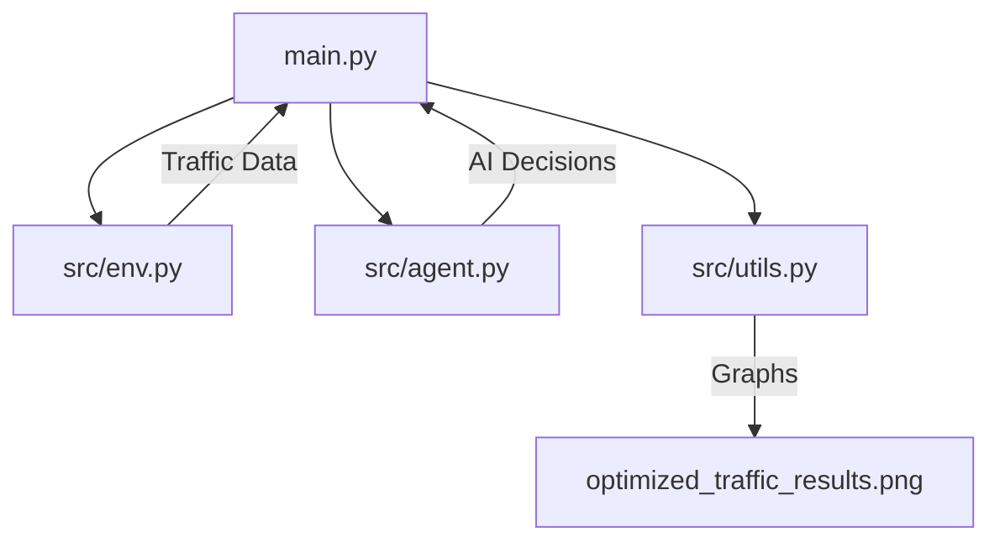

# 🚦 SmartTraffic Multi-Agent RL

> **An intelligent traffic signal management system powered by Multi-Agent Reinforcement Learning (MARL).**


## 🌟 Overview 

Imagine two neighboring traffic junctions. Usually, traffic lights operate on simple timers, regardless of how many cars are actually waiting. 

In this project, we replace those "dumb" timers with **AI Agents**. These agents are like students learning to play a game:
1. **The Goal**: Keep the lines as short as possible.
2. **The Reward**: If the queue is short, they get a "score." If traffic backs up, they lose points.
3. **The Teamwork**: Because the junctions are neighbors, the agents "talk" to each other indirectly. If one junction is overwhelmed, the other learns to adjust its timing to help its neighbor out.

Over hundreds of simulations, the AI discovers the perfect "rhythm" for the signals that no human-programmed timer could match.

---

## 🚀 Key Features

- **🧠 Collaborative AI**: Two independent agents that learn to coordinate their signal phases.
- **⚡ Optimized Learning**: Custom "State Aggregation" technique that allows the AI to learn **60% faster** than standard models.
- **🧩 Modular Design**: Cleanly separated code for the Environment, the AI Agents, and the Visualization dashboard.
- **📊 Real-time Dashboard**: Generates comprehensive 6-graph analytics showing everything from reward trends to junction imbalances.

---

## 🛠️ Project Structure



- **`src/env.py`**: The "World." It handles car arrivals, lane physics, and signal logic.
- **`src/agent.py`**: The "Brain." It contains the Q-Learning logic and the experience memory.
- **`src/utils.py`**: The "Eyes." It handles all the complex math for the moving averages and dashboard generation.

---

## 🏃 How to Run

1. **Install Dependencies**:
   ```bash
   pip install -r requirements.txt
   ```

2. **Run the Simulation**:
   ```bash
   python main.py
   ```

After the simulation finishes (500 episodes), you will find a file named `optimized_traffic_results.png` in your folder with the full performance breakdown.

---

## 📈 Understanding the Results

When looking at the generated dashboard:
- **Total Reward**: Should be moving **upwards** (closer to 0). This means the agents are failing less!
- **Avg Queue**: Should be moving **downwards**. This means the roads are getting clearer.
- **50 ep MA**: This is the "Big Picture" view. It filters out the random traffic spikes to show the true learning trend.

---

> [!TIP]
> **Why is this better than normal traffic lights?**
> Standard traffic lights are static. This AI reacts to congestion in real-time. If there's an unexpected surge from the North, the AI detects it instantly and extends the green light, while coordinating with the next junction to prevent a "gridlock" chain reaction.
