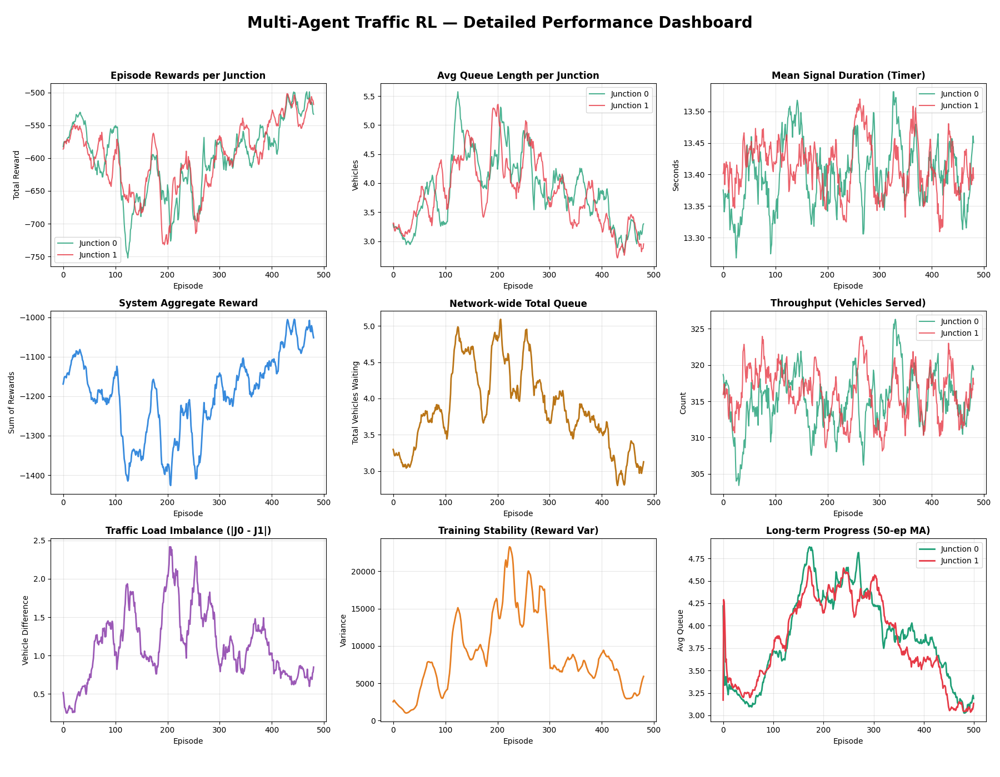

# Advanced Traffic Navigation System using Multi-Agent Reinforcement Learning

## Overview
This project presents an intelligent traffic signal control system built using Multi-Agent Reinforcement Learning (RL). The system optimizes traffic flow across multiple junctions by dynamically adjusting signal timings based on real-time traffic conditions.

The objective is to reduce congestion, minimize waiting time, and improve overall traffic throughput compared to traditional fixed-timing systems.

---

## Core Concepts

### Reinforcement Learning
- Uses Q-Learning for decision making
- Multi-agent setup where each junction acts as an independent agent
- Agents learn optimal signal timings through rewards and penalties

### Graph Data Structure
The traffic network is modeled as a graph to represent a real-world city layout:

- Vertices (Nodes): Traffic junctions  
- Edges: Roads connecting junctions  

This structure allows efficient simulation of traffic flow and interdependence between intersections.

---

## Performance Dashboard



The above visualization represents the training and performance metrics of the system.

### Metrics Included
- Episode rewards per junction
- Average queue length per junction
- Mean signal duration
- System-wide aggregate reward
- Network-wide total queue
- Throughput (vehicles served)
- Traffic load imbalance
- Training stability (reward variance)
- Long-term moving average trends

---

## Project Structure
│
├── src/
│ ├── environment.py # Traffic simulation environment
│ ├── agent.py # RL agent implementation (Q-learning)
│ ├── train.py # Training loop
│ ├── utils.py # Helper utilities
│
├── data/
│ ├── traffic_data.csv # Input or simulated traffic data
│
├── assets/
│ ├── dashboard.png # Performance visualization image
│
├── results/
│ ├── logs.txt # Training logs
│ ├── metrics.csv # Output performance metrics
│
├── README.md
└── requirements.txt


---

## Working Methodology

1. The traffic network is initialized as a graph.
2. Each junction (node) is assigned an RL agent.
3. Agents observe:
   - Queue lengths
   - Traffic density
4. Agents take actions:
   - Adjust signal timing dynamically
5. Rewards are calculated based on:
   - Reduction in waiting time
   - Improvement in traffic flow
6. Over multiple episodes, agents learn optimal policies.

---

## Installation

Clone the repository and install dependencies:

```bash
git clone https://github.com/your-username/Advanced-traffic-nav-system.git
cd Advanced-traffic-nav-system
pip install -r requirements.txt

---

 
Improved traffic flow efficiency
Reduced vehicle waiting time
Lower congestion compared to fixed signal systems
Adaptive behavior based on traffic conditions

---

